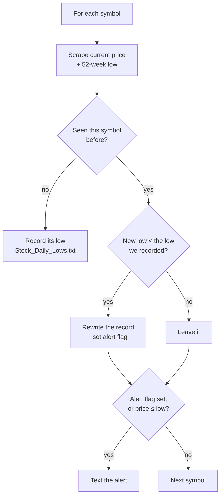

# DOW Watchdog

Watches a list of stocks and texts you when one of them touches a **52-week low**.

Written in 2018. The premise: a 52-week low is worth *hearing about* the day it
happens, and checking by hand is exactly the kind of thing you stop doing after a
week.

## How it decides to text you

The naive version — "is the price at or below the 52-week low?" — fires on stale
information. A stock can dip under its low, recover, and still read as a buy hours
later. So the watchdog keeps its own record of each symbol's previous low and
alerts on the *transition*, not the state:



Because the alert keys off a *change* in the recorded low, the script can run
hourly instead of continuously — which was the actual point. Fewer requests, less
chance of getting your IP blacklisted.

## Files

| File | Purpose |
|---|---|
| `DOW_Watchdog.py` | The loop above — compare, update the record, send |
| `Stock_Price_Fetch.py` | Scrapes current price and 52-week low from a quote page |
| `SP_500.py` | The watchlist — 10 symbols, edit to taste |
| `Stock_Daily_Lows.txt` | The record of previous lows. Its memory between runs |

## Running it

```bash
python DOW_Watchdog.py     # schedule this hourly with cron
```

Set the Gmail credentials and destination number at the top of `DOW_Watchdog.py`
first. Texting works through the carriers' free email-to-SMS gateways
(`5551234567@vtext.com`, `@txt.att.net`, and so on) — no Twilio, no API bill.

## Status

**Archival — this does not run today.** It scrapes prices by string-matching
`"regularMarketPrice":{"raw":` out of a Yahoo Finance quote page, and that page
stopped looking like that years ago. Gmail also no longer accepts a plain SMTP
login without an app password.

Both are shallow fixes — point `Stock_Price_Fetch.py` at a real quote API and the
logic above still holds. Kept as-is because the interesting part was never the
scraping; it was deciding when *not* to send a message.
